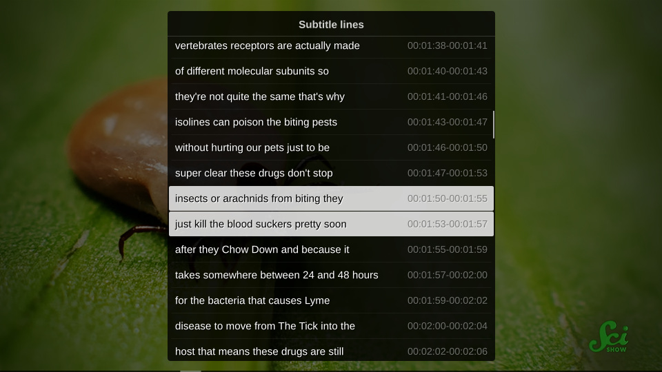

# mpv-subtitle-lines
List and search subtitle lines of the selected subtitle track.  
Select a line to seek to it's start time.



Requires [uosc](https://github.com/tomasklaen/uosc) 5.0 (not released yet)

## Current limitations

* Only searches subtitles that mpv has loaded internally.
* After seeking mpv only provides the current subtitle line and requires some (short) playback for the other lines to become available.
* Acquiring subtitle lines isn't 100% accurate.

## Installation
1. Save the `subtitle-lines.lua` into your [scripts directory](https://mpv.io/manual/stable/#script-location)
2. Set key bindings in [`input.conf`](https://mpv.io/manual/stable/#input-conf)
    ```
    Ctrl+f script-binding subtitle_lines/list_subtitles
    ```